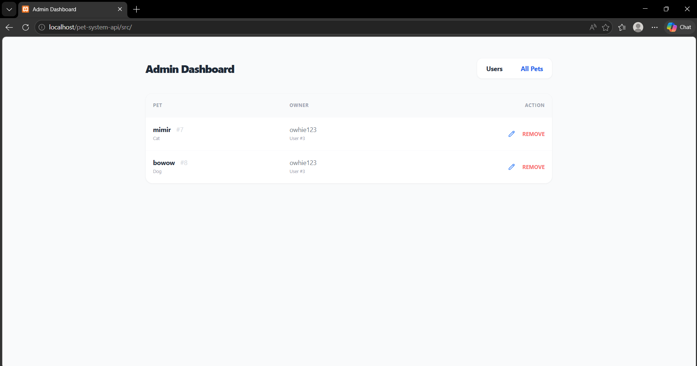
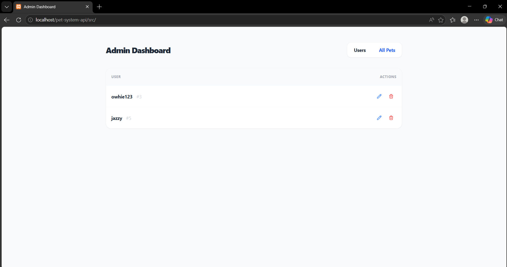
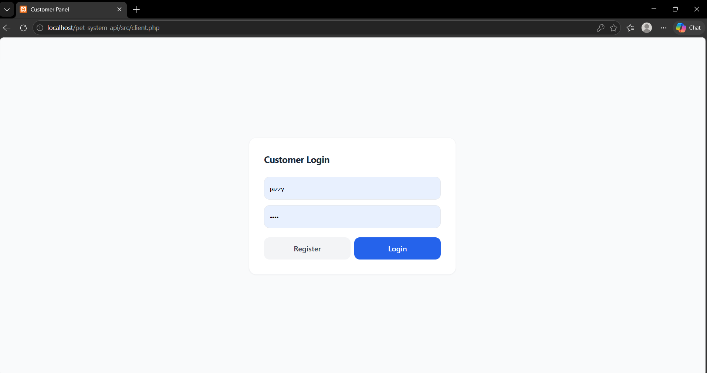
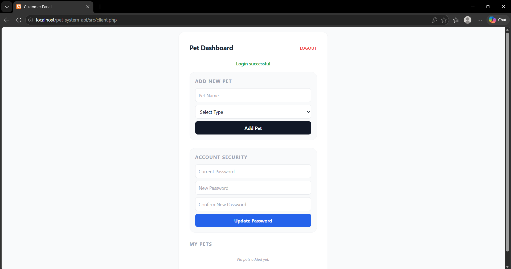

# Pet Management System - Backend API

Hey team! This repository holds our Group REST API Enhancement project. I have initialized the repository with our core backend architecture.

## Table of Contents
1. [System Overview & Plan](#system-overview-plan)
2. [Current Backend Files](#current-backend-files)
3. [Client Screenshots](#client-screenshots)
4. [Run with Docker](#run-with-docker)
5. [Run with XAMPP](#run-with-xampp)
6. [Current API Actions](#current-api-actions)

## System Overview & Plan

The goal of this project is to build a centralized REST API that can communicate with multiple different client applications.

Our planned architecture:

- **The Backend (Server):** A PHP-based REST API that connects to a MySQL database. It will handle user authentication and CRUD operations for pet records.
- **Client 1 (PHP):** A server-side Customer Panel where users can log in using sessions and manage their own pets.
- **Client 2 (JavaScript/HTML):** A client-side Admin Dashboard using the Fetch API to view and manage all users and pets in the system.

## Current Backend Files

I have set up the initial backend files to get us started:

- **`db.php` (Database Integration):**
  - Connects to the local MySQL database named `user_system`.
  - Includes built-in error handling. If the database connection drops, it will output a clean JSON error (HTTP 500) instead of crashing the PHP script.
  - **Refer to the schema below:**


- **`api.php` (REST API Logic):**
  - This is our main controller. It forces all responses into strict JSON format with proper HTTP headers.
  - Includes a custom `respond()` function to easily send back standard HTTP status codes (200, 201, 400, 409, 500).
  - **Currently Implemented:** 
      - The `register` endpoint. It accepts a username and password, checks if the user already exists, hashes the password for security, and saves it to the database.
      - The `login` endpoint. It accepts a username and password, checks if both fields match its corresponding record in the database, and responds accordingly: (1) for **empty field/s**, returns an error; (2) if **user does not exist**, it returns an error; (3) if the **password is incorrect**, it blocks login and returns an error; (4) if **username and password match** the ones in the database, it returns a success response.
      - The `get_users` endpoint. It returns all users with compatibility fields for `display_name` and `created_at`.
      - The `update_user` endpoint. It accepts a valid existing user ID and updates `username` and/or `password` for that same user only.
      - The `create_pet` endpoint. It accepts a pet name and its type (species), and saves it into the database.
      - The `update_pet` endpoint. It accepts a pet ID and at least one field (`pet_name` or `pet_type`) to update an existing pet record.
      - The `delete_pet` endpoint. It accepts a pet ID and deletes the pet from the database. 
      - The `get_pets` endpoint. It optionally accepts a user ID. If left null (empty), it will return all pets in the database. If a user ID is specified, it responds with all the pets for that user.

- **`client.php` (Client 2 - Customer Panel):**
  - This is the PHP-based client interface designed for pet owners. It utilizes server-side sessions and communicates with the REST API to provide a personalized management experience.

  - **User Authentication:**
    - Handles secure login and registration by sending POST requests to the API.
    - Validates user input before sending data.
    - Stores authenticated user data using PHP sessions.
    - Provides logout functionality by destroying the active session.

  - **Personalized Dashboard:**
    - Dynamically retrieves pet records using the `get_pets` endpoint.
    - Filters and displays only the pets associated with the currently logged-in user.
    - Ensures that users can only view their own data for privacy and security.

  - **Pet Registration:**
    - Allows users to add new pets through a form interface.
    - Uses a predefined list of pet types (e.g., Dog, Cat, Bird, etc.).
    - Sends data to the `create_pet` endpoint for storage in the database.
    - Displays success or error messages based on API response.

  - **Update & Delete Logic:**
    - Provides interactive modals for editing pet details such as name and type.
    - Sends updated data to the `update_pet` endpoint.
    - Enables pet deletion by sending requests to the `delete_pet` endpoint.
    - Updates the UI in real-time to reflect changes without requiring a full page reload.

  - **Responsive UI:**
    - Built using Tailwind CSS for a clean and modern design.
    - Ensures responsiveness across desktops, tablets, and mobile devices.
    - Uses consistent styling for forms, buttons, modals, and tables to enhance user experience.

## Client Screenshots

### `index.html`



### `client.php`



## Run with Docker

1. Copy `.env.example` to `.env` if needed, then review DB credentials.
2. From project root, run:
   ```bash
   docker compose up --build
   ```
3. Open:
   - API base: `http://localhost:8080/api.php`
   - Healthcheck: `http://localhost:8080/healthcheck.php`
   - phpMyAdmin: `http://localhost:8081`

The DB is initialized automatically from `src/database/user_system.sql`.

## Run with XAMPP

1. Start **Apache** and **MySQL** in XAMPP.
2. Place this project in `xampp/htdocs/`.
3. Import `src/database/user_system.sql` into DB `user_system` via phpMyAdmin.
4. Use API at:
   - `http://localhost/pet-system-api/src/api.php`
   - `http://localhost/pet-system-api/src/healthcheck.php`

`src/db.php` defaults for XAMPP local mode:

- `DB_HOST=127.0.0.1`
- `DB_USER=root`
- `DB_PASS=` (empty)
- `DB_NAME=user_system`
- `DB_PORT=3306`

## Current API Actions

Send requests to `src/api.php` with `action=<action_name>`.

- `register` (POST)
- `login` (POST)
- `add_pet` (POST)
- `delete_pet` (POST/DELETE)
- `get_pets` (GET/POST)
- `get_users` (GET/POST)
- `update_pet` (POST/PUT/PATCH)
- `update_user` (POST/PUT/PATCH)

Standalone health endpoint:
- `healthcheck.php` (GET)

Compatibility response mode:
- `get_users` and `update_pet` return compatibility payloads by default.
- Add `wrap=1` in query/body to return wrapped format:
  - `{ "status": "...", "message": "...", "data": ... }`
  
